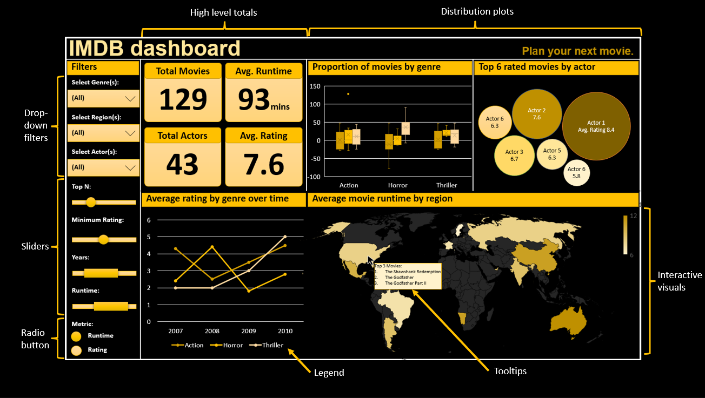

# imdb_dashboard

The IMDb dashboard is primarily targeted towards movie producers to present a consolidated crisp view of the average ratings and runtime for movies by genres and regions with interactive abilities to help them choose and plan their next movie.

## Dashboard description

Our dashboard consists of one web page that shows overall summary and 4 main reactive plots:

- The high level totals

These are a set of 4 numeric totals showing the total count of movies, the average runtime across all movies, the total number of actors across all movies, and the average rating of all movies based on the filters applied.

- The distribution of movies by genre

This is a box plot showing the genres on the x-axis and the count of movies on the y-axis. The box plots will be categorized by a categorical column, for e.g., top 3 regions.

- How movie ratings vary over time

This is a line chart showing the years on the x-axis and the mean rating per genre on the y-axis. The individual lines may be coloured by other features such as genre or region of production.

- The top rated movies by actor

This is a bubble chart where each bubble represents an actor and the size and color of the bubble represents the number of movies that the actor performed in and the label indicates the average rating of those movies. The user can choose the number of actors that are depicted for each year using a slider.

- A map showing summary statistics about movies produced in each region

Our dataset contains information from various regions around the world, so this map can be used to explore how movie characteristics vary by region. The map will show an aggregation for the movies produced in a particular region (e.g. the mean rating, the count, or mean number of ratings).

Additionally, the filters in the navigation pane on the left-hand side allows users to filter the dataset by genres, regions, or actors. Further below we have individual sliders to adjust top N (actors/regions/genres), minimum rating, year range to filter for, runtime to filter for. Finally, there is a set of radio buttons that allows the user to switch the numeric metric between average runtime and average rating. Changing these filters will update the data that is used to generate the plots. The displayed charts will be interactive enabling users to get more granular information through tooltips by hovering over the visuals/data points.

## App sketch

## Contributions

|  Contributor  |  Github Username |
|--------------|------------------|
|  Abdul Moid Mohammed |  @iamMoid |
|  Brandon Lam |  @ming0701  |
|  Nikita Shymberg  |  @NikitaShymberg |

We welcome and recognize all contributions. Please find the guide for contribution in [Contributing Document](https://github.com/UBC-MDS/imdb_dashboard/blob/main/CONTRIBUTING.md).

## License

`imdb_dashboard` was created by Abdul Moid Mohammed, Brandon Lam and Nikita Shymberg. It is licensed under the terms of the MIT license.